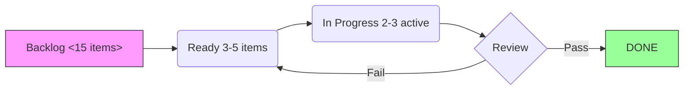

# Trung tâm điều hành dự án

> Hub trung tâm cho **kanban plugin** + dataview + tasks-plugin + obsidian-git  
> Quản lý mọi dự án theo hệ thống -- theo dõi trạng thái, bảng Kanban, đánh giá sprint

## Tổng quan các dự án đang hoạt động (lệnh Dataview)

````dataview
TABLE status as "Trạng thái", type as "Loại", file.ctime as "Bắt đầu"
FROM "10-Projects"
WHERE status != "archived"
SORT file.mtime DESC
````

## Cấu hình bảng Kanban

**Plugin: obsidian-kanban** -- Tạo board cho MI mỗi dự án với các cột:

In ngược -> Sẵn sàng -> Đang làm _Priend Review -> Done

### Bắt đầu nhanh bảng Kanban mới:
1. Ctrl+P -> "Kanban: tạo bảng điều khiển mớikanban"  
2. Tên: `ProjectName-board.kanban`
3. Cột: Backlog | Ready | Doing | Review | Done
4. Mỗi thẻ = wikilink đến ghi chú dự án hoặc file giao sản phẩm

### Loại thẻ Kanban (khuôn mẫu qua Templater):
```yaml
## Khuôn mẫu Thẻ (điều khiển bởi templater)
- Type: milestone/feature/bug/review 
- Priority: P1/P2/P3/P4  
- Due: YYYY-MM-DD
- Blocked by: [[ ]]
- Tags: #project/#status/
```

## Theo dõi Sprint dự án (biểu đồ Mermaid)

**Plugin: nàng tiên cá + nàng tiên cá.j vẽ**

### Ví dụ: Trạng thái Sprint hiện tại


## Tích hợp nhật ký commit Git

**Plugin: obsidian-git** -- Xem lịch sử commit trực tiếp trong Obsidian

### Các commit Git gần đây (qua git log)
> Mở Command Palette -> "Git: Show History" để xem timeline

```bash
# Xem 10 commit cuối cùng của vault (chạy qua terminal hoặc xuất pandoc)
git log --oneline --since="7 days ago" -n 10
```

### Cài đặt tự động sao lưu Git
- Đồng bộ mỗi: 5 phút (khuyến nghị)  
- Khuôn mẫu commit: `[HH:mm] <hành-dộng>: "<mô-tả>"`
- Chiến lược nhánh: chỉ main (không cần nhánh feature trong PKM cá nhân)

## Bảng điều hành rủi ro dự án

**Plugin: dataview + table-editor-obsidian**

| Dự án | Hành động tiếp theo | Hạn chót | Mức độ tin cậy | Mức độ rủi ro |
|---------|-------------|----------|------------|------------|
| `Project 1` | | | Xanh/Lục/Vàng/Đỏ | THẤP/TRUNG BÌNH/CAO |
| `Project 2` | | | Xanh/Lục/Vàng/Đỏ | THẤP/TRUNG BÌNH/CAO |

### Các yếu tố rủi ro (đánh giá tự động)
- Cao = nhiệm vụ quá hạn + không có sản phẩm giao trong 30+ ngày
- Trung bình = tiến độ bị đình trệ >14 ngày nhưng đang thảo luận tích cực  
- Thấp = đang di chuyển theo kế hoạch
