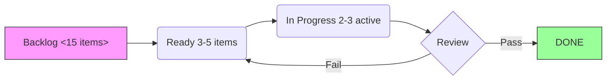

# Project Command Center

> Central hub cho **kanban plugin** + dataview + tasks-plugin + obsidian-git  
> Quan ly moi project theo he thong -- status tracking, kanban board, sprint review

## Active Projects Overview (dataview query)

````dataview
TABLE status as "Status", type as "Type", file.ctime as "Started"
FROM "10-Projects"
WHERE status != "archived"
SORT file.mtime DESC
````

## Kanban Board Configuration

**Plugin: obsidian-kanban** -- Tao board cho MI mỗi project voi cac columns:

Backlog -> Ready -> Doing | Review -> Done

### Quick Start New Project Kanban:
1. Ctrl+P -> "Kanban: Create new kanban board"  
2. Name: `ProjectName-board.kanban`
3. Columns: Backlog | Ready | Doing | Review | Done
4. Each card = wikilink to project note or deliverable file

### Kanban Card Types (template via templater):
```yaml
## Card Template (templater-driven)
- Type: milestone/feature/bug/review 
- Priority: P1/P2/P3/P4  
- Due: YYYY-MM-DD
- Blocked by: [[ ]]
- Tags: #project/#status/
```

## Project Sprint Tracking (mermaid diagram)

**Plugin: mermaid-tools + mermaid.js rendering**

### Example: Current Sprint Status


## Git Commit Log Integration

**Plugin: obsidian-git** -- Xem commit history truc tiep trong Obsidian

### Recent Git Commits (via git log)
> Open Command Palette -> "Git: Show History" de view timeline

```bash
# View last 10 commits to vault (run with terminal or pandoc export)
git log --oneline --since="7 days ago" -n 10
```

### Git Auto-Backup Settings
- Sync every: 5 minutes (recommended)  
- Commit template: `[HH:mm] <action>: "<description>"`
- Branch strategy: main only (no need for feature branches in personal PKM)

## Project Risk Dashboard

**Plugin: dataview + table-editor-obsidian**

| Project | Next Action | Due Date | Confidence | Risk Level |
|---------|-------------|----------|------------|------------|
| [Project 1](/) | | | Green/Yellow/Red | LOW/MEDIUM/HIGH |
| [Project 2](/) | | | Green/Yellow/Red | LOW/MEDIUM/HIGH |

### Risk Factors (auto-assessed)
- High = overdue task + no deliverable in 30+ days
- Medium = progress stalled >14 days but active discussion  
- Low = moving forward per plan
