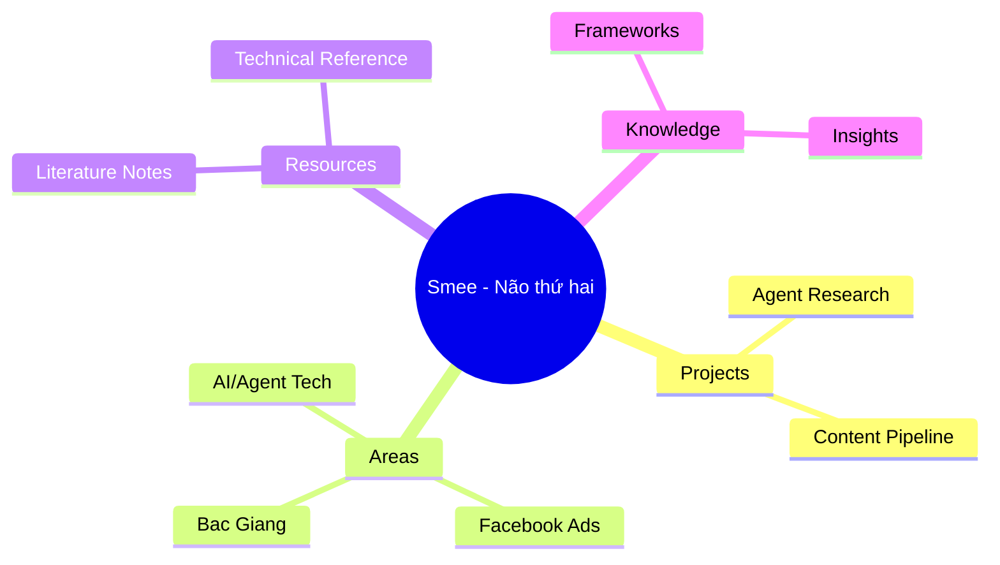
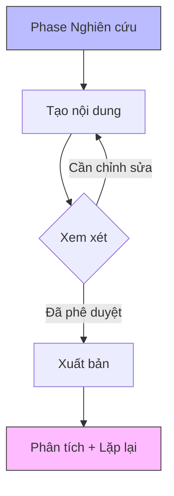

# Bộ công cụ phân tích kho lưu trữ

> Bộ sưu tập các quy trình phân tích khai thác **obsidian-charts + obsidian-mind-map + mermaid-tools**  
> Trực quan hóa cấu trúc kho lưu trữ, xu hướng tăng trưởng và mẫu hình kiến thức

## Bản đồ tư duy cấu trúc kho lưu trữ

**Plugin: obsidian-mind-map** -- Chuyển đổi tiêu đề của bất kỳ ghi chú nào thành bản đồ tư duy tương tác

1. Mở bất kỳ ghi chú nào (ví dụ: Vault-MOC.md)
2. Ctrl+P -> "MindMap: Show current file as mindmap"
3. Tự động tạo bản đồ tư duy có thể nhấp từ cấu trúc H1/H2/H3
4. Xuất ra .mm hoặc xem trực tiếp

### Áp dụng cho:
- `00-Meta/Vault-MOC.md` -> Xem toàn bộ kho lưu trữ một cái nhìn tổng quan
- `20-Areas/Facebook-Ads/INDEX.md` -> Lập bản đồ mạng lưới kiến thức quảng cáo Facebook
- `10-Projects/*/` -> Trực quan hóa các phụ thuộc dự án

## Mẫu biểu đồ

**Plugin: obsidian-charts** -- Cấu hình mẫu biểu đồ trong `_templates/chart-template.md`

### Biểu đồ 1: Tăng trưởng kiến thức theo thời gian (biểu đồ đường)
```json
{
  "type": "area",
  "config": {
    "title": "Tăng trưởng kho lưu trữ - Ghi chú theo tháng",
    "xLabel": "Tháng",
    "yLabel": "Số lượng ghi chú được tạo",
    "data": [
      {"month": "Jan", "notes": 10},
      {"month": "Feb", "notes": 25}
    ]
  }
}
```

### Biểu đồ 2: Phân bố chủ đề (biểu đồ tròn) 
```json
{
  "type": "pie",
  "config": {
    "title": "Ghi chú theo danh mục",
    "data": [
      {"label": "Facebook Ads", "value": 47},
      {"label": "Bắc Giang", "value": 12},
      {"label": "AI/Agent", "value": 30},
      {"label": "Văn học", "value": 8},
      {"label": "Khác", "value": 15}
    ]
  }
}
```

### Biểu đồ 3: Hoạt động hàng tuần (biểu đồ cột)
**Use case:** Theo dõi số lượng ghi chú/nhiệm vụ được tạo mỗi tuần  
**Data source:** Ngày sửa đổi tệp từ `02-Daily/` + `10-Projects/`

## Đồ thị quan hệ kiến thức Mermaid

**Plugin: mermaid-tools** -- Hiển thị trực tiếp các sơ đồ mermaid trong Obsidian

### Bản đồ mối quan hệ chủ đề


### Bản đồ phụ thuộc dự án


## Quy trình lưu trữ trang web

**Plugins: obsidian-clipper + pdf-plus**

### Quy trình thu thập tiêu chuẩn:
1. **Lưu trang web:** Sử dụng tiện ích mở rộng trình duyệt (Obsidian Clipper) để lưu bài viết  
   -> Tự động lưu vào `20-Areas/Web Clips/` kèm siêu dữ liệu trích xuất
2. **Ghi chú PDF:** Kéo thả tệp PDF vào Obsidian -> sử dụng plugin pdf-plus  
   -> Các điểm nổi bật được giữ nguyên, xuất ra định dạng markdown
3. **"Lưu để xem sau":** Bất kỳ nguồn tài liệu chưa đọc nào -> Lưu theo quy tắc #5 ở trên

### Frontmatter trang web (tự động tạo bởi clipper):
```yaml
title: "Tiêu đề nguồn"
source_url: "https://example.com/article"
clipped: YYYY-MM-DD
category: resource
tags: [clipped, <topic>]
status: backlog
type: web-clip
```

## Thiết lập đồng bộ hóa từ xa

**Plugin: remotely-save** -- Đồng bộ đám mây cho thiết bị di động/máy tính để bàn

### Cấu hình gợi ý (Settings -> Remotely Save):
- Dịch vụ: OneDrive / Dropbox / iCloud  
- Tự động đồng bộ: Khi lưu + mỗi 5 phút
- Giải quyết xung đột: Giữ phiên bản mới nhất tự động hợp nhất

## Hướng dẫn tùy chỉnh biểu tượng

**Plugin: obsidian-icon-folder** -- Thêm biểu tượng vào tệp/thư mục để quét trực quan

### Biểu tượng khuyến nghị (kiểu emoji):
| Thư mục | Biểu tượng gợi ý | Lý do |
|--------|----------------|-------|
| `10-Projects/` | rocket | Dự án có thể khởi chạy |
| `20-Areas/` | target | Các lĩnh vực đang tập trung |
| `30-Resources/` | book | Thư viện tham khảo |
| `40-Knowledge-Synthesis/` | lightbulb | Nhận thức & tổng hợp |
| `_templates/` | star | Mẫu là nguồn tài liệu đặc biệt |

### Thiết lập: Settings -> Obsidian Icon Folder -> Thêm bộ tùy chỉnh

## Các trường hợp sử dụng Canvas nâng cao

**Plugin: advanced-canvas (6.3.0)** -- Không gian làm việc phong phú cho các dự án phức tạp

### Canvas 1: "Bệ phóng dự án"
Tạo canvas liên kết với bất kỳ dự án nào kèm theo:
- Thẻ bảng Kanban (plugin kanban)
- Bản đồ tư duy về các bên liên quan/phụ thuộc  
- Biểu đồ Gantt thời gian (plugin mermaid)
- Liên kết ghi chú thành thẻ trên canvas
- Chế độ trình chiếu (tính năng advanced-canvas phiên bản 6.x)

### Canvas 2: "Bảng điều khiển nghiên cứu"
Cho các dự án nghiên cứu sâu:
- Nhúng trang PDF -> ghi chú pdf-plus
- Bảng dữ liệu từ web -> dữ liệu bảng tạm
- Thanh bên kết nối ngữ nghĩa -> gợi ý smart-connections
- Bản đồ tư duy về khái niệm -> tích hợp obsidian-mind-map

---

*Bộ công cụ phân tích tích hợp charts + mind-map + mermaid + clipper + remote-save + icon-folder.*
