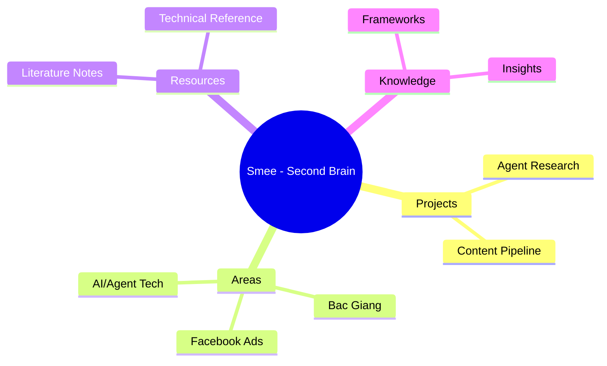
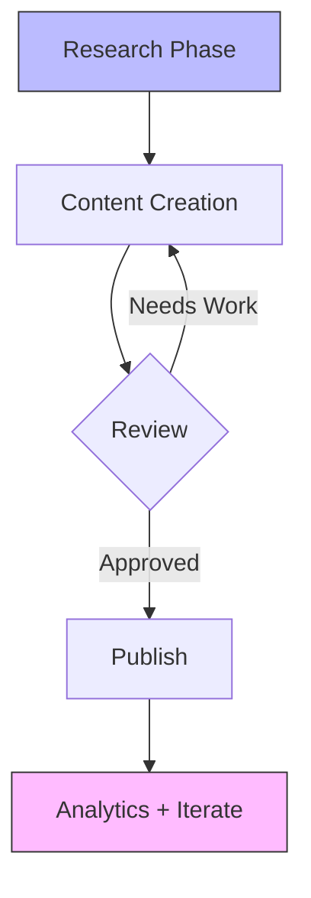

# Vault Analytics Suite

> Collection cua analytics workflows khai thac **obsidian-charts + obsidian-mind-map + mermaid-tools**  
> Visualize vault structure, growth trends, and knowledge patterns

## Vault Structure Mind Map

**Plugin: obsidian-mind-map** -- Convert any note's headings into interactive mind map

1. Open any note (e.g., Vault-MOC.md)
2. Ctrl+P -> "MindMap: Show current file as mindmap"
3. Automatically generates clickable mind map from H1/H2/H3 structure
4. Export to .mm or view inline

### Apply to:
- `00-Meta/Vault-MOC.md` -> View entire vault at-a-glance
- `20-Areas/Facebook-Ads/INDEX.md` -> Map ads knowledge network
- `10-Projects/*/` -> Visualize project dependencies

## Chart Templates

**Plugin: obsidian-charts** -- Config chart templates trong `_templates/chart-template.md`

### Chart 1: Knowledge Growth Over Time (line chart)
```json
{
  "type": "area",
  "config": {
    "title": "Vault Growth - Notes by Month",
    "xLabel": "Month",
    "yLabel": "Notes Created",
    "data": [
      {"month": "Jan", "notes": 10},
      {"month": "Feb", "notes": 25}
    ]
  }
}
```

### Chart 2: Topic Distribution (pie chart) 
```json
{
  "type": "pie",
  "config": {
    "title": "Notes by Category",
    "data": [
      {"label": "Facebook Ads", "value": 47},
      {"label": "Bac Giang", "value": 12},
      {"label": "AI/Agent", "value": 30},
      {"label": "Literature", "value": 8},
      {"label": "Other", "value": 15}
    ]
  }
}
```

### Chart 3: Weekly Activity (bar chart)
**Use case:** Track how many notes/tasks created each week  
**Data source:** File modification dates from `02-Daily/` + `10-Projects/`

## Mermaid Knowledge Graphs

**Plugin: mermaid-tools** -- Render mermaid diagrams truc tiep trong Obsidian

### Topic Relationship Map


### Project Dependency Map


## Web Clipper Workflow

**Plugins: obsidian-clipper + pdf-plus**

### Standard Capture Flow:
1. **Web page clip:** Use browser extension (Obsidian Clipper) to save article
   -> Auto-saves to `20-Areas/Web Clips/` with extraction metadata
2. **PDF annotation:** Drag PDF into Obsidian -> use pdf-plus plugin  
   -> Highlights persist, export as markdown
3. **"Save for Later":** Any unread resource -> Clip per #5 rule above

### Web Clip Frontmatter (auto-generated by clipper):
```yaml
title: "Source Title"
source_url: "https://example.com/article"
clipped: YYYY-MM-DD
category: resource
tags: [clipped, <topic>]
status: backlog
type: web-clip
```

## Remote Sync Setup

**Plugin: remotely-save** -- Cloud sync cho mobile/desktop

### Suggested Config (Settings -> Remotely Save):
- Service: OneDrive / Dropbox / iCloud  
- Auto-sync: On save + every 5 min
- Conflict resolution: Keep newest version auto-merge

## Icon Customization Guide

**Plugin: obsidian-icon-folder** -- Add icons to files/folders cho visual scanning

### Recommended Icons (emoji style):
| Folder | Suggested Icon | Rationale |
|--------|----------------|-----------|
| `10-Projects/` | rocket | Projects are launchable |
| `20-Areas/` | target | Areas of ongoing focus |
| `30-Resources/` | book | Reference library |
| `40-Knowledge-Synthesis/` | lightbulb | Insights & synthesis |
| `_templates/` | star | Templates are special resources |

### Setup: Settings -> Obsidian Icon Folder -> Add custom set

## Advanced Canvas Use Cases

**Plugin: advanced-canvas (6.3.0)** -- Rich workspace cho complex projects

### Canvas 1: "Project Launchpad"
Create a canvas linked to any project with:
- Kanban board card (plugin kanban)
- Mind map of stakeholders/dependencies  
- Timeline Gantt chart (mermaid plugin)
- Link notes as cards on canvas
- Presentations mode (advanced-canvas feature 6.x)

### Canvas 2: "Research Dashboard"
For deep research projects:
- Embed PDF pages -> pdf-plus annotation
- Data tables from web -> clipboard data
- Semantic connections sidebar -> smart-connections suggestions
- Mind maps of concepts -> obsidian-mind-map integration

---

*Analytics Suite tích hợp charts + mind-map + mermaid + clipper + remote-save + icon-folder.*
