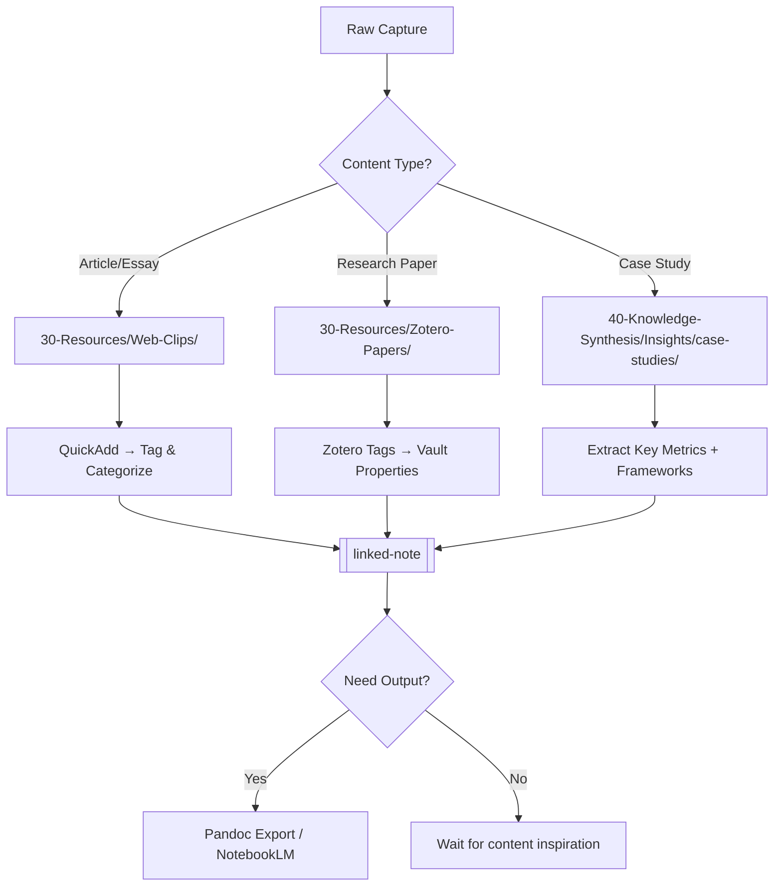

# Research Ingestion Pipeline — From Source to Output

Automated flow: Web → Zotero/Clipper → Obsidian Vault → Final Content.

## Pipeline Stages

### Stage 1: Capture (Input)

| Tool | Use Case | Destination | Automation |
|------|----------|-------------|------------|
| **Obsidian Clipper** | Save full web articles | 30-Resources/Web-Clips/ | Browser extension → auto-tag by domain |
| **Zotero Connector** | Academic papers, case studies | 30-Resources/Zotero-Papers/ | Zotero desktop sync to vault |
| **QuickAdd Web Clip** | Quick save without full article | 30-Resources/Web-Clips/quick-clips.md | Ctrl+Q → Web Clip macro |

### Stage 2: Process (Organize)



### Stage 3: Synthesize (Knowledge)
- **Auto-tagging**: Use `tag-wrangler` to organize by topic clusters
- **Smart Connections**: Leverage existing embeddings to find related notes automatically  
- **Manual synthesis**: Create atomic insights in 40-Knowledge-Synthesis/Insights/

### Stage 4: Output (Distribution)

| Format | Tool | Destination |
|--------|------|-------------|
| Blog post / guide | Pandoc → HTML/PDF | 70-Outputs/blog-posts/ |
| Presentation slides | Longform plugin → Excalidraw | 70-Outputs/slides/ |
| Study materials | NotebookLM Studio (audio/video) | External |
| Flashcards | SRS plugin export | Internal learning |

## Folder Structure for Research

```
30-Resources/
├── Web-Clips/           ← Raw captures from Clipper/QuickAdd
│   ├── uncategorized/   ← Needs processing within 48h
│   └── processed/       ← Tagged and linked (archive)
├── Zotero-Papers/       ← PDFs + metadata from Zotero sync
├── Facebook-Ads/        ← Existing FB research
└── Bac-Giang/           ← Local market research

40-Knowledge-Synthesis/
├── Insights/
│   └── case-studies/    ← Synthesized analysis with metrics
└── Frameworks/          ← Extracted frameworks from research
```

## QuickAdd Macros for Research

### Ctrl+Q → Save to Zotero
- Prompt: "Enter title and tags"
- Creates note in 30-Resources/Zotero-Papers/ with metadata frontmatter
- Links to Zotero entry (if URL provided)

### Ctrl+Q → Process Web Clip  
- Opens all unprocessed files in 30-Resources/Web-Clips/uncategorized/
- Batch process: tag, categorize, create links
- Moves processed files to archive

### Ctrl+Q → Generate Case Study
- Takes source notes (web clip + existing insights)
- Creates structured case study in Insights/case-studies/
- Extracts metrics, frameworks, actionable takeaways

## Pipeline Health Metrics

Track these weekly:
- New captures per week (target: 10+)
- Processed vs unprocessed ratio (target: >80% processed within 48h)
- Output artifacts created (blog posts, slides, flashcards)
- Knowledge synthesis notes added to vault

---
*Configured: 2026-06-20 by Smee — Layer 5 (Research Pipeline)*
