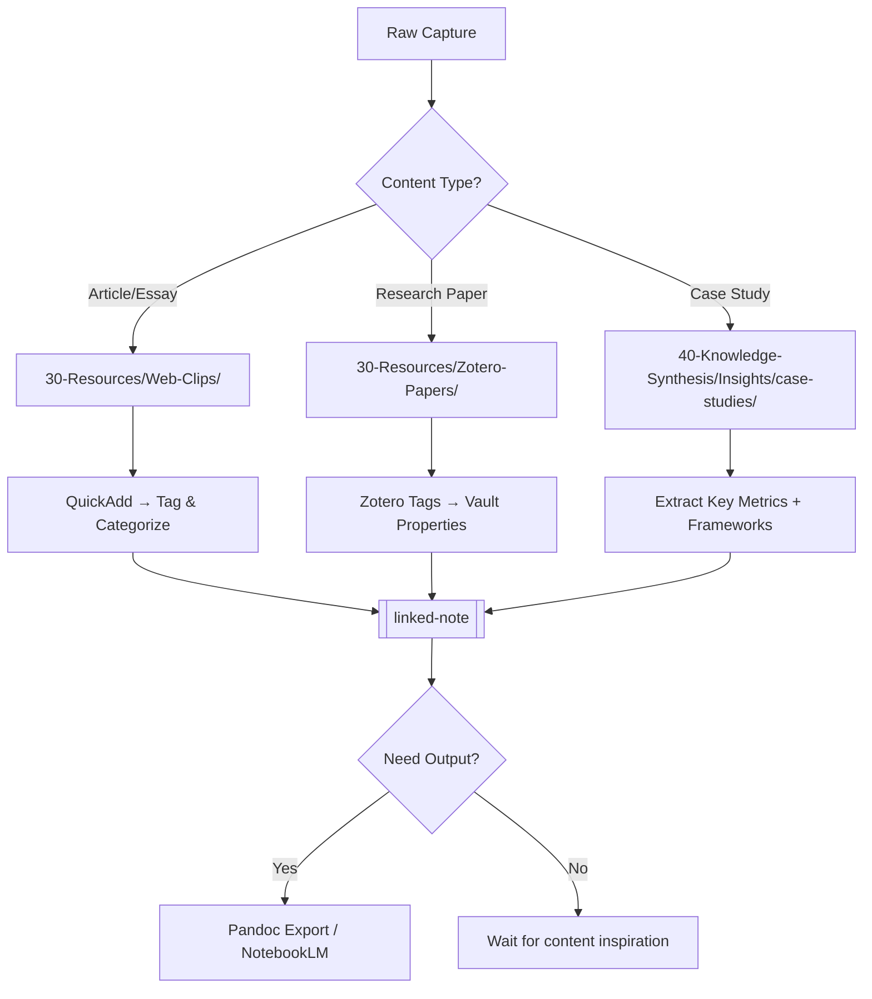

# Tìm kiếm sự thông minh — Từ nguồn đến xuất khẩu

Dòng chảy tự động: Web _SPero/ Cipper _Griper Obsidian Cánh cổng cuối cùng.

## Pipeline Stages

### Giai đoạn 1: Bắt (tiểu)

| Tool | Use Case | Destination | Automation |
|------|----------|-------------|------------|
| **Obsidian Clipper** | Save full web articles | 30-Resources/Web-Clips/ | Browser extension → auto-tag by domain |
| **Zotero Connector** | Academic papers, case studies | 30-Resources/Zotero-Papers/ | Zotero desktop sync to vault |
| **QuickAdd Web Clip** | Quick save without full article | 30-Resources/Web-Clips/quick-clips.md | Ctrl+Q → Web Clip macro |

### Giai đoạn 2: Tiến trình (Tổ chức)


```mermaid
graph TD
    A[Raw Capture] --> B{Content Type?}
    B -->|Article/Essay| C[30-Resources/Web-Clips/]
    B -->|Research Paper| D[30-Resources/Zotero-Papers/]
    B -->|Case Study| E[40-Knowledge-Synthesis/Insights/case-studies/]
    
    C --> F[QuickAdd → Tag & Categorize]
    D --> G[Zotero Tags → Vault Properties]
    E --> H[Extract Key Metrics + Frameworks]
    
    F --> I[[linked-note]]
    G --> I
    H --> I
    
    I --> J{Need Output?}
    J -->|Yes| K[Pandoc Export / NotebookLM]
    J -->|No| L[Wait for content inspiration]
```

### Giai đoạn 3: Tổng hợp (cũng biết)
- Dùng `tag-wrangler` để tổ chức theo nhóm chủ đề
- **Smart Connections**: sự thay đổi lớn đã có để tìm các ghi chú liên quan tự động  
- **Sự tổng hợp theo hướng nam**: tạo ra các nhận thức nguyên tử trong 40-cấu hiểu biết-Synthesis/Insights/

### Giai đoạn 4: Kết xuất (sự phân phối)

| Format | Tool | Destination |
|--------|------|-------------|
| Blog post / guide | Pandoc → HTML/PDF | 70-Outputs/blog-posts/ |
| Presentation slides | Longform plugin → Excalidraw | 70-Outputs/slides/ |
| Study materials | Sổ tay ghi chép (audio/video) | External |
| Flashcards | SRS plugin export | Internal learning |

## Cấu trúc thư mục cho nghiên cứu

```
30-Resources/
├── Web-Clips/           ← Raw captures from Clipper/QuickAdd
│   ├── uncategorized/   ← Needs processing within 48h
│   └── processed/       ← Tagged and linked (archive)
├── Zotero-Papers/       ← PDFs + metadata from Zotero sync
├── Facebook-Ads/        ← Existing FB research
└── Bac-Giang/           ← Local market research

40-Knowledge-Synthesis/
├── Insights/
│   └── case-studies/    ← Synthesized analysis with metrics
└── Frameworks/          ← Extracted frameworks from research
```

## QuickAdd vĩ mô để nghiên cứu

### Ctrl+Q _ Lưu vào Ztero
- Nhắc: "Enter tựa và thẻ"
- Tạo chú thích trong 30 mã nguồn/Zotero-Pates/ with Meta frontmatter
- Liên kết tới mục nhập Zotero (nếu URL đã cung cấp)

### Ctrl+Q  
- Mở tất cả các tập tin chưa được xử lý trong 30 mã nguồn/Web-Clips/unctemized/
- Tiến trình bó: thẻ, phân loại, tạo liên kết
- Chuyển tập tin đã xử lý vào kho lưu

### Ctrl+Q Tạo ra Bài học Chữ hoa/ thường
- Lấy ghi chú nguồn (chúng tôib clip + các sự hiểu biết tồn tại)
- Tạo ra nghiên cứu trường hợp có cấu trúc trong Insights/ccydies/
- Rút ra các thước đo, khung, các hình thức có thể thực hiện

## Các phương pháp giải phẫu đường ống

Theo dõi những tuần này:
- Bắt mới mỗi tuần (tearget: 10+)
- Tiến trình tương ứng với tỷ lệ chưa xử lý (tearget: >80% được xử lý trong 48h)
- Các tạo tác xuất được tạo (các bài, slide, thẻ flash)
- Ghi chú tổng hợp kiến thức đã được thêm vào hầm

---
*Contture: 2026-06-20 by Smee — Lớp 5 (Reoseline)*
