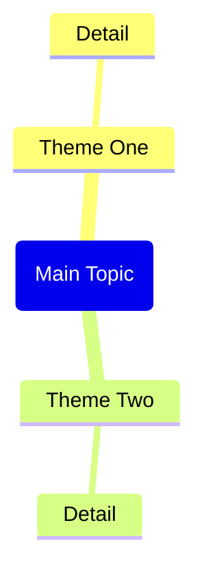

title: "<page title>"
source: "<page url>"
description: "<brief description>"
tags:
  - "clippings"
---

## Summary

<Brief 2-3 paragraph summary of the page content>

## Key Takeaways

<List 5-8 key takeaways as bullet points>

## Mindmap

Bộ óc cá nhân họcmap các quy tắc cú pháp - phải theo chính xác:
- Định dạng nút gốc: gốc (topic Name) - dùng dấu ngoặc tròn, NO double ngoặc
- Nút con: chỉ cần nhập thô, không cần dấu ngoặc
- KHÔNG dùng dấu ngoặc kép, ngoặc hoặc bất kỳ ký tự đặc biệt nào trong văn bản
- Giữ mọi chữ nút ngắn và đơn giản - tối đa 3-4 từ mỗi nút

```mermaid
mindmap
  root(Main Topic)
    Theme One
      Detail
    Theme Two
      Detail
```

## Notable Quotes

<List 3-5 notable quotes from the content, if any>

Chỉ cần trở về markdown Nội dung mà không có lời giải thích hay lời bình luận.