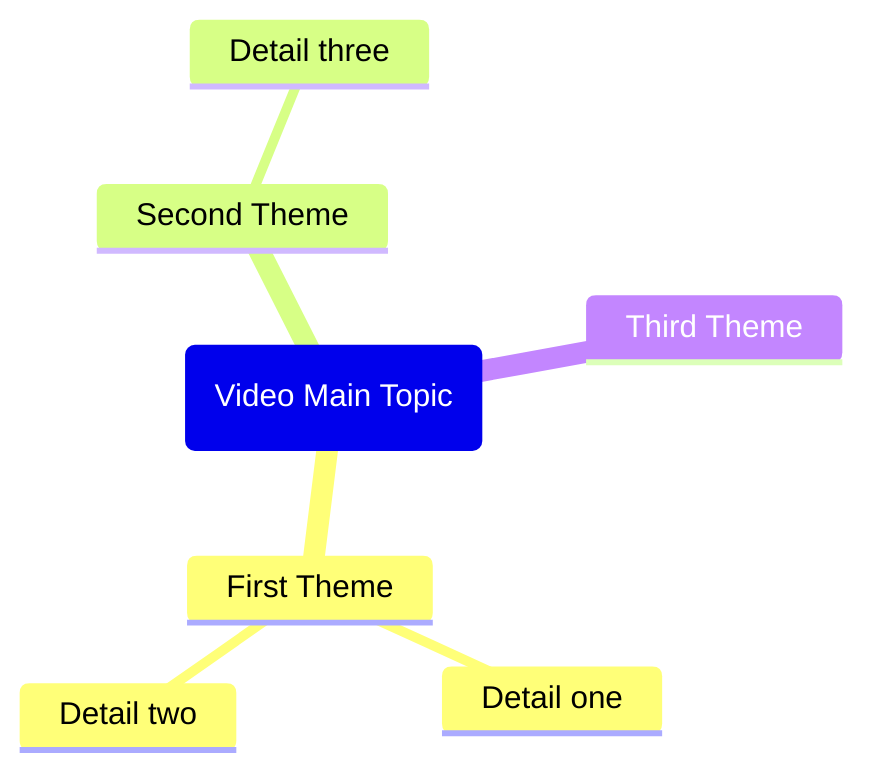

title: "<video title>"
description: "<first 200 chars of description>"
channel: "<channel name>"
url: "<video url>"
duration: "<duration>"
published: <upload date in YYYY-MM-DD format>
thumbnailUrl: "<YouTube thumbnail URL: i.ytimg.com/vi/VIDEO_ID/maxresdefault.jpg with https protocol>"
genre:
  - "<genre>"
watched:
---

> [!summary]- Description
> <full video description, preserve line breaks>

## Summary

<Brief 2-3 paragraph summary of the video content>

## Key Takeaways

<List 5-8 key takeaways as bullet points>

## Mindmap

Bộ óc cá nhân họcmap các quy tắc cú pháp - phải theo chính xác:
- Định dạng nút gốc: gốc (topic Name) - dùng dấu ngoặc tròn, NO double ngoặc
- Nút con: chỉ cần nhập thô, không cần dấu ngoặc
- KHÔNG dùng dấu ngoặc kép, ngoặc hoặc bất kỳ ký tự đặc biệt nào trong văn bản
- KHÔNG dùng biểu tượng hay emojis
- Giữ mọi chữ nút ngắn và đơn giản - tối đa 3-4 từ mỗi nút
- Chỉ dùng chữ cái, số và khoảng trống

Ví dụ cú pháp CORRECT:

## Notable Quotes

<List 5-10 notable quotes from the transcript. Format each as:>
- [<timestamp>: <quote text>](<video_url>&t=<seconds>s)

Chỉ cần trở về markdown Nội dung mà không có lời giải thích hay lời bình luận.
